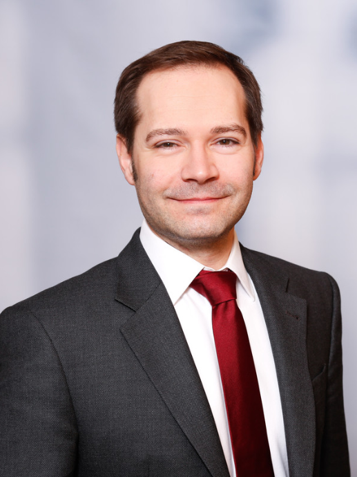

# Christian Schömer
Augustenstr. 3 
04317 Leipzig 
Germany 

<a href="schoemer@runbox.com">schoemer@runbox.com</a> - +49 (0) 179 421 1272 
<a href="https://www.linkedin.com/in/cschoemer">www.linkedin.com/in/cschoemer</a>

## Executive Summary

- Trusted Business Continuity Management advisor for 2 DAX enterprises (Energy Trading, Life Sciences)
- 15 years of experience in all phases of the BCM life cycle
- Applied common standards and good practices e.g., BS 25999, ISO 22313, German BSI Standard 100-4, BCI Good Practice Guidelines
- Successfully set up BCM as new global function at DAX enterprise (implementing processes & procedures, evaluating & compiling BC plans, recruiting and training global, regional, and local BCM personnel)
- Activated BC plans and personally managed both BC incidents and crisis events
	
## Professional Experience

### Deloitte Consulting
`2019/01 - present`
**Industry Team Lead Oil, Gas & Chemicals**, Berlin, Germany
- Annual sales > 4 M EUR, annual managed revenue > 3 M EUR
- Account management for one of Deloitte‘s priority Chemicals and one of Deloitte‘s priority Life Sciences accounts, account teams grown from 3 to 17 people
- Recruiting, on-boarding, performance evaluation, counseling - assigned teams at > 70 % utilization despite COVID-19
- Launch of *RestartNow* service offering, ensuring business continuity for site operations
- *COVID-19* related incident & crisis management of consulting teams at Chempark Leverkusen
- Launch of *Connected Supply Chain*, a tactical BCM tool to manage business continuity incidents throughout global supply chains
- Internal liaison between Deloitte Risk Advisory and Deloitte Consulting to coordinate Business Continuity Management engagements
- *Project reference:* Carve-out, Project Manager, Chemicals, Leverkusen, Germany - IT Operations carve-out of network, workplace, server & storage, infrastructure applications, collaboration platform, document management, SAP etc. and related IT operations processes as critical element of a high priority, high visibility M&A project, total business value > 2,5 B EUR while ensuring Business Continuity

### Accenture
`2017/06 - 2018/12`
**Senior Manager**, Berlin, Germany
- Annual sales > 10 M EUR, annual managed revenue > 2 M EUR
- Recruiting, on-boarding, performance evaluation, counselling
- Service offering development *New IT*, team grown from 4 to 21 people
- Delivery management, project management, and consulting for CIO advisory and digital transformation

### Deloitte Consulting
`2015/05 - 2017/05`
**Senior Manager**, Berlin, Germany
- Annual sales > 2 M EUR, annual managed revenue > 1 M EUR
- Recruiting, on-boarding, performance evaluation, counselling
- Service offering developments *IoT Lab* and *Value Chain Resilience*, IoT team grown from 2 to 8 people
- Launch of *Value Chain Resilience* as strategic BCM tool, extending BCM capabilities from local site focus to a connected, global level - both process and product based BC management (e.g., life-saving medicines)
- Delivery management, project management, and consulting for CIO services and digital transformation
- *Project reference:* Business Continuity Management, Program Manager and SME Business Continuity Management, Life Sciences, Leverkusen, Germany - Impact study of a wide area power outage in Germany’s Rhine-Ruhr metropolitan area on the global value chain of blockbuster products including life-saving medicines (*medically necessary drug products*)

### Lodestone Management Consultants
`2013/01 - 2015/04`
**Principal**, Munich, Germany
- Annual sales ~ 1 M EUR, annual managed revenue ~ 0,5 M EUR, recruiting, on-boarding, performance evaluation, counselling
- Consulting in Business Continuity Management, IT Risk Management, and IT Service Management
- *Project reference:* Business Continuity Management, Program Manager and SME Business Continuity Management, Life Sciences, Leverkusen, Germany - Initiation, pilot, and execution of a global Business Continuity Management Program, implementating the global function *Business Continuity Management* as part of the client's Enterprise Risk Management

### IDS Scheer
`2006/09 - 2012/12`
**Manager** (from 2010/01 on, Senior Consultant before), Saarbrücken, Germany
- Responsible for BCM, Security, and Crisis Management during project assignment in Saudi Arabia (2,5 years, 140 consultans, 11 country organizations)
- Evacuation of consultants and teachers during Arab Spring uprisings out of Alexandria, Egypt
- Ensuring business continuity and keeping up project delivery and operations for global distributed team during Eyjafjallajökull eruption grounding flight operations
- Global Champion GRC, professional leadership in Business Continuity Management (BCM) and IT Risk Management, leveraging BCM project results for ARIS GRC
- Development of process based Business Impact Analysis and BC planning, launched with new ARIS product release
- Project Management, Consulting in Business Process Management, Enterprise Architecture Management, IT Governance, Risk & Compliance, IT Risk Management, IT Security Management, IT Service Management, and Business Continuity Management
- Business Development & Practice Development (recruiting, on-boarding, performance evaluation, counselling, service offering development)
- *Project references:*
  - Supply Chain Management, Head of PMO and SME Project Management, Chemicals, Riyadh, Saudi Arabia - Implementation of SAP-based Supply Chain Management processes, an e-Commerce Portal, and a Business Intelligence Platform; responsible for Project Management Office, change management, risk management and issue management, emergency response & contingency planning, evacuation of consultants and teachers during Arab Spring uprisings out of Alexandria, Egypt, keeping up project delivery and operations for global distributed team during Eyjafjallajökull eruption grounding flight operations
  - Cyber Security, SME Cyber Security, *German Federal Armed Forces, Bonn, Germany* - Design of client specific adaptions of ITIL V3 processes *IT Service Continuity Management* and *Information Security Management* based on ISO 27001 and IT-Grundschutz (BSI)

### Business Continuity Management
`2008/01 - 2008/07`
**Head of PMO and SME Project Management**  
*Energy Trading, Düsseldorf, Germany* 
Design and implementation of an integrated Business Continuity Management System (BCMS) according to BS 25999 followed by the European wide integration of 9 market units into the newly set-up, central BCMS while supporting and coaching the BCM team

### Business Continuity Management
`2007/10 - 2007/12`
**SME Business Continuity Management**  
*Financial Services, Saarbrücken, Germany* 
Operational support of the Business Continuity Manager and redesign of the Business Continuity Management framework, including quality control of earlier analysis (Business Impact Analysis, etc.), integration of BCM into the corporate Safety & Security Management, and coaching client personnel

### Business Continuity Management
`2006/07 - 2009/01`
**Deputy Business Continuity Manager & Program Manager**  
*Energy Trading, Munich, Germany* 
Design and implementation of an integrated Business Continuity Management System (BCMS) followed by operational support and redesign of the Business Continuity Management framework acting as Deputy Business Continuity Manager during an enterprise restructuring
-	Supporting and coaching the Business Continuity Manager
- Fit/gap analysis of current BCM processes against good practices
-	Design and implementation of a customized software solution for the ARIS Business Architect to support and perform BCM activities (Business Impact Analysis, qualitative and quantitative Risk Analysis, automatic creation of emergency response plans) 
-	Preparation, execution and debriefing of emergency exercises
-	Design and implementation of an incident & crisis management process followed by the integration of BCM into the corporate Risk Management

### inoplex AG
`2003/01 - 2006/07`
**Founder, Board Member, CEO** (from 2005/07 on), Saarbrücken, Germany
- Head of sales, Delivery, and HR
- Business Development & Consulting Practice Development
- Program Management, Consulting in Cyber Security, IT Risk Management and Business Continuity Management

## Project Experience (Selection)

	
###	Cyber Security
`2015/08 - 2015/09`
**SME Digital Transformation and Cyber Security**  
*Technology, Munich, Germany* 
Market research and trends analysis based on 3rd party analyst data and Deloitte’s point of view; as-is analysis of the client's current Cyber Security services portfolio and respective fit/gap analysis against identified trends; realignment of the Cyber Security services portfolio and respective roadmap
	

### Business Continuity Management
`2012/02 - 2015/06`
**Program Manager and SME Business Continuity Management**  
*Life Sciences, Leverkusen, Germany* 
Initiation, pilot, and roll-out of a global Business Continuity Management Program:
-	Scope definition for a new BCM program focusing on IT related BCM requirements
-	Stakeholder analysis and securing management board support 
-	Develop and pilot methodology, processes, and tools to enable business units to implement all phases of the BCM life cycle
-	Design and implementation of a global BCM governance
-	Recruitment and build-up of a global BCM team and several local BCM pilot teams
-	Roll-out to > 150 entities to perform Business Impact Analysis and Business Continuity Planning according to previously defined methodology
- Implementation of the global function *Business Continuity Management* as part of the client's Enterprise Risk Management

###	Supply Chain Management
`2009/02 - 2011/07`
**Head of PMO and SME Project Management**  
*Chemicals, Riyadh, Saudi Arabia* 
Implementation of SAP-based Supply Chain Management processes, an e-Commerce Portal, and a Business Intelligence Platform
- Project Management Office, Change Management
-	Project planning and project controlling (62.000 consulting days, 11 country subsidiaries)
-	Risk management and issue management
-	Scope management (change requests, etc.)
-	Support and coaching of project managers
-	Further development of project management methods
-	Resource management (recruitment, staffing, onboarding, support)
-	Emergency Response & Contingency Planning
-	Definition of administrative project processes, assurance of compliance
-	Procurement management (internal and external ordering processes)
- Evacuation of consultants and teachers during Arab Spring uprisings out of Alexandria, Egypt
- Keeping up project delivery and operations for global distributed team during Island volcano grounding flight operations
- Op Risk, BCM and Crisis Mgmt during Saudi Arabia

### Cyber Security
`2008/09 - 2008/12`
**SME Cyber Security**  
*German Federal Armed Forces, Bonn, Germany* 
Design of client specific adaptions of ITIL V3 processes *IT Service Continuity Management* and *Information Security Management* based on ISO 27001 and IT-Grundschutz (BSI)

### Business Continuity Management
`2008/01 - 2008/07`
**Head of PMO and SME Project Management**  
*Energy Trading, Düsseldorf, Germany* 
Design and implementation of an integrated Business Continuity Management System (BCMS) according to BS 25999 followed by the European wide integration of 9 market units into the newly set-up, central BCMS while supporting and coaching the BCM team

### Business Continuity Management
`2007/10 - 2007/12`
**SME Business Continuity Management**  
*Financial Services, Saarbrücken, Germany* 
Operational support of the Business Continuity Manager and redesign of the Business Continuity Management framework, including quality control of earlier analysis (Business Impact Analysis, etc.), integration of BCM into the corporate Safety & Security Management, and coaching client personnel

### Business Continuity Management
`2006/07 - 2009/01`
**Deputy Business Continuity Manager & Program Manager**  
*Energy Trading, Munich, Germany* 
Design and implementation of an integrated Business Continuity Management System (BCMS) followed by operational support and redesign of the Business Continuity Management framework acting as Deputy Business Continuity Manager during an enterprise restructuring
-	Supporting and coaching the Business Continuity Manager
- Fit/gap analysis of current BCM processes against good practices
-	Design and implementation of a customized software solution for the ARIS Business Architect to support and perform BCM activities (Business Impact Analysis, qualitative and quantitative Risk Analysis, automatic creation of emergency response plans) 
-	Preparation, execution and debriefing of emergency exercises
-	Design and implementation of an incident & crisis management process followed by the integration of BCM into the corporate Risk Management

### Cyber Security
`2004/06 - 2005/12`
**Project Manager and SME Cyber Security**  
*Public Sector, German State Capital* 
Risk analysis of various technical processes based on the *IT-Grundschutz* manual, ISO 17799 and self-developed procedures; implementation of an IT risk management process based on *IT-Grundschutz* methodology, ISO 17799 and ITIL; ongoing Cyber Security advisory, including:
- Ensuring Business Continuity of a European Union IT Service while under cyber attack
- Development of a policy management system for the centralized creation, maintenance and distribution of policies, taking into account various areas of validity
- Development of reverse-proxy, web application firewall

## Languages
German (native) 
English (C1/C2) 
French (A2) 
Dutch (A2)

## Education
Bachelor of Science, Computer Science (specialist field: *Cryptography & Security*), Saarland University, Saarbrücken, Germany 
Baccalaureate, Gymnasium Am Stadtgarten, Saarlouis, Germany

## BCM relevant information
- Heidelberg Akademie
- Mimenzug Notfallübung

# Tasks/responsibilities
- **OK** Develop, implement and maintain a business continuity management (BCM) and related governance framework with specific focus on DBG’s subsidiary Fondcenter AG
- Corresponding to that, enhance the second line of defence oversight on Business and IT Operations
- **OK** Develop, implement and maintain an incident & crisis management process
- **OK** Support yearly Business Impact Analysis assessments
- **OK** Coordinate the execution and reporting of BCM tests
- Design, collect, monitor and report BCM KPI / KRI metrics 
- **OK** Become a trusted business advisor for BCM topics: provide guidance related to business continuity plans and interdependencies, foster awareness and facilitate a proactive involvement of business areas in business continuity management
- **OK** Interact with other control functions like Information Security, Outsourcing and Risk Management
- **OK** Provide input and support to key projects and change processes
- **OK** Interact with external BCM interest groups/organizations and keep abreast of changes in regulations and industry best practices

# Qualifications/required skills
- **OK** Ideally 5 years of experience in Business Continuity Management and/or IT Service Continuity Management (incl. IT Contingency & IT Disaster Recovery Planning) – with a focus on financial services/banking/financial market infrastructure providers. 
- Very good knowledge of Business Continuity Management practices and protocols, including international BCM standards promoted by BCI/DR/ISO and relevant regulations (MaRisk, CSDR, CSSF 12/552, CPMI IOSCO, etc.)
- Good knowledge of IT infrastructure, IT & Cyber Security and operations processes of financial market infrastructure providers, including specific technical knowledge would be a plus.
- **OK** Good knowledge in developing and maintaining an incident & Crisis management process for (complex) matrix organisations. 
- Good knowledge of the operational risk profile of Deutsche Börse Group (DBG). 
- **OK** Excellent analytical skills, creativity, critical thinking and the ability to identify problems and propose solution
- **OK** Fluency in English is mandatory. German knowledge would be an asset.

https://career.deutsche-boerse.com/job/Luxembourg-Business-Continuity-Management-Officer-%28fmd%29/623198001/
https://www.howtomakepartner.com/business-case-for-partnership-law-firm-big-4-consulting-firm/

### Personal interests
